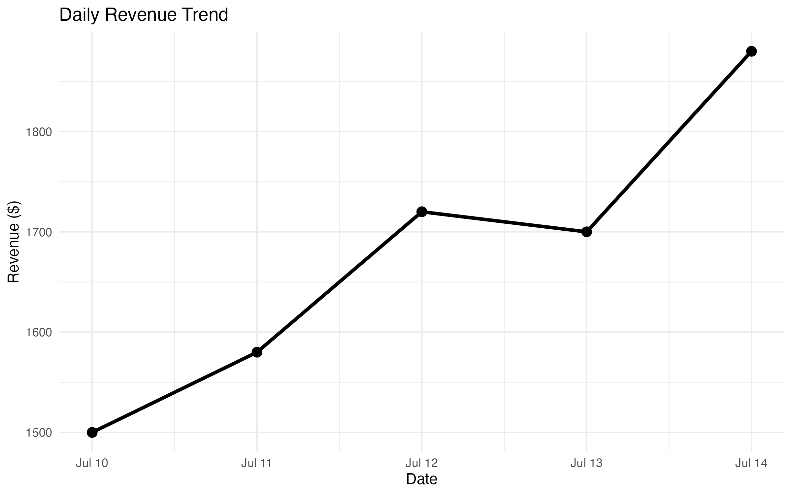
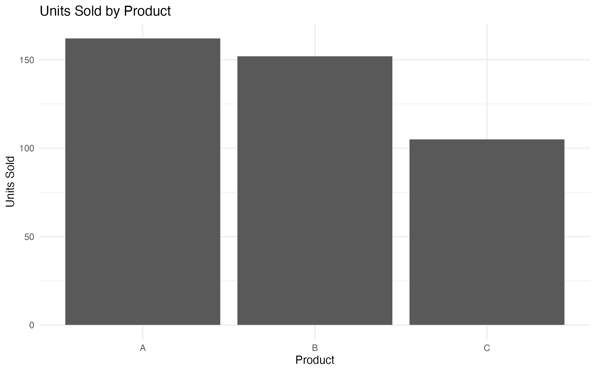
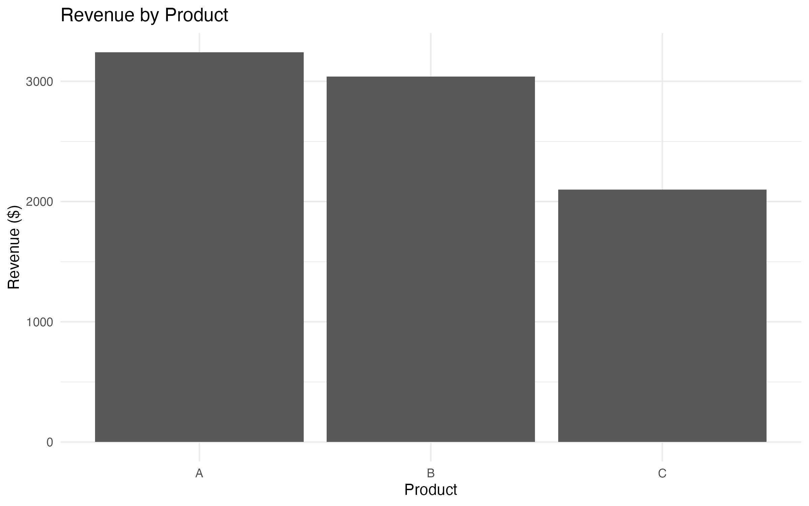

# Daily Performance Summary

This report was automatically generated by the Daily Report Mailer.


## Key Performance Indicators


### Total Units Sold

`r total_units`


### Total Revenue

$`r total_revenue`


### Average Daily Revenue

$`r round(average_daily_revenue,2)`


### Top Performing Product

`r top_product$Product`


# Revenue Trend

```{r revenue_chart, echo=FALSE}



```


# Units Sold by Product

```{r units_chart, echo=FALSE}



```


# Revenue by Product

```{r revenue_product_chart, echo=FALSE}



```


# Daily Data Table

```{r}

daily_summary

```
