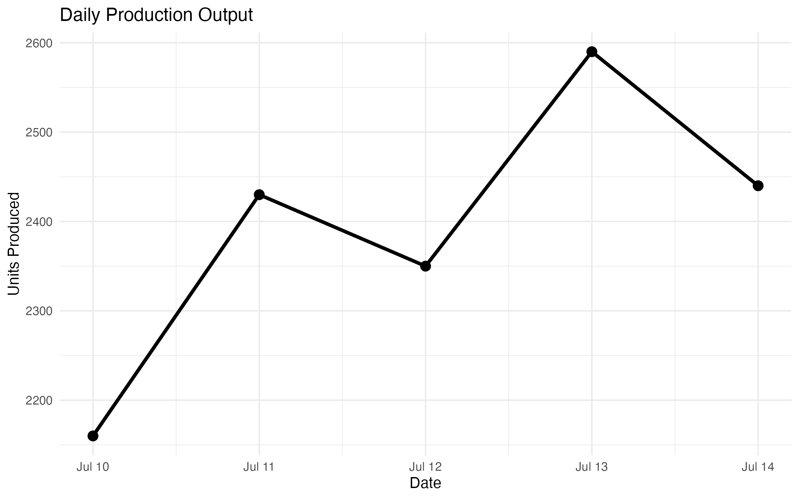
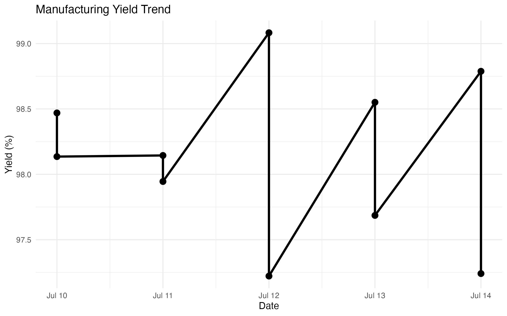
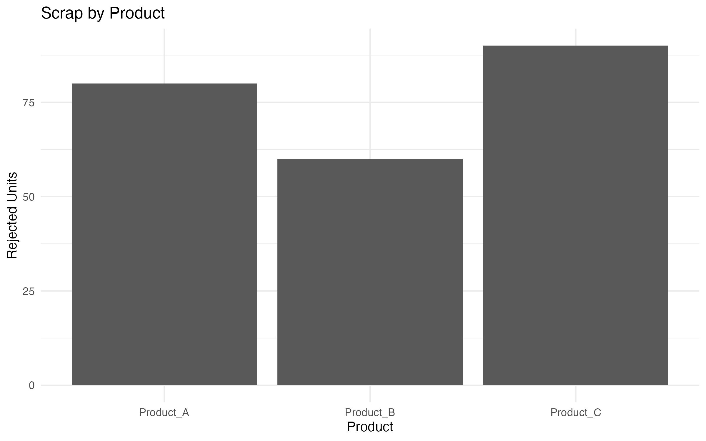
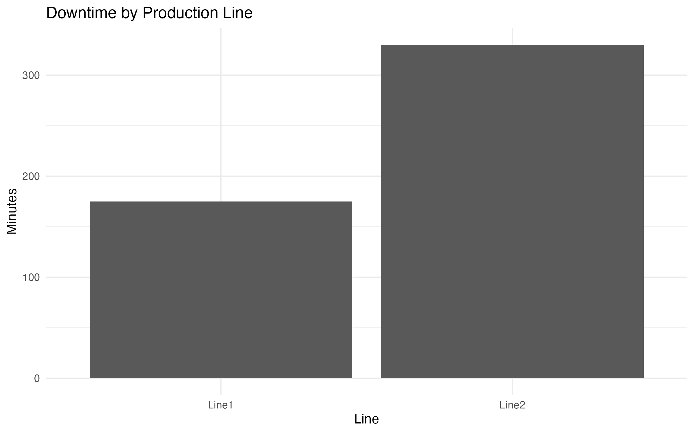
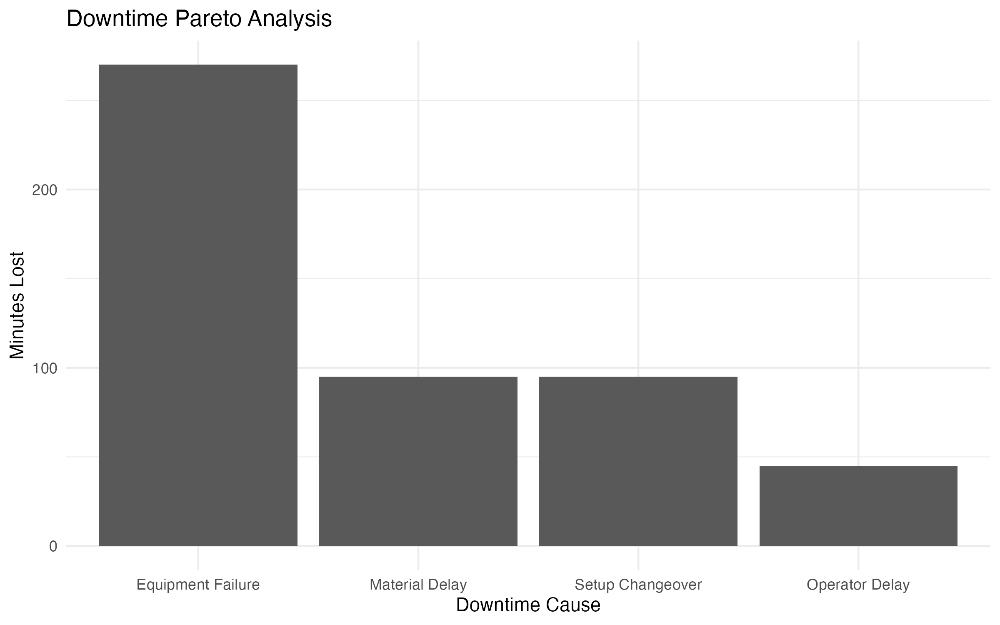

# Manufacturing Performance Summary

This report was automatically generated from daily production data using the Daily Report Mailer automation pipeline.


---

# Production KPIs


## Total Production Output

`r format(total_production, big.mark=",")` units


## Average Yield

`r round(average_yield,2)` %


## Average Scrap Rate

`r round(average_scrap,2)` %


## Average Downtime

`r round(average_downtime,1)` minutes


## Overall Equipment Effectiveness (OEE)

`r round(average_oee,2)` %


---

# Production Output Trend


```{r production_output, echo=FALSE}



```


---

# Yield Performance


```{r yield_chart, echo=FALSE}



```


---

# Quality Analysis


## Scrap by Product


```{r scrap_chart, echo=FALSE}



```


---

# Equipment Performance


## Downtime by Production Line


```{r downtime_chart, echo=FALSE}



```


---

# Downtime Root Cause Analysis


The largest contributor to downtime was:

## `r top_downtime_issue`


```{r pareto_chart, echo=FALSE}



```


---

# Batch Performance Data


```{r}

production_kpis

```


---

# Automated Engineering Recommendations


```{r recommendations, results='asis'}

for(rec in recommendations){

cat(
paste0(
"- ",
rec,
"\n\n"
)
)

}

# Yield Assessment

if(average_yield < 95){

cat(
"⚠ **Yield is below target. Review process variation, equipment condition, and operating parameters.**"
)

} else {

cat(
"✓ **Yield performance is within acceptable limits.**"
)

}


# Scrap Assessment

if(average_scrap > 3){

cat(
"\n\n⚠ **Scrap rate requires investigation. Review defect trends and process controls.**"
)

} else {

cat(
"\n\n✓ **Scrap rate is within acceptable limits.**"
)

}


# Downtime Assessment

if(average_downtime > 60){

cat(
"\n\n⚠ **Downtime is elevated. Review maintenance history and recurring failure modes.**"
)

} else {

cat(
"\n\n✓ **Downtime is within expected range.**"
)

}


# OEE Assessment

if(average_oee < 85){

cat(
"\n\n⚠ **OEE is below world-class manufacturing targets. Improvement opportunities identified.**"
)

} else {

cat(
"\n\n✓ **OEE performance is strong.**"
)

}

```

---

# Report Complete

Generated automatically by the Daily Report Mailer manufacturing analytics system.
