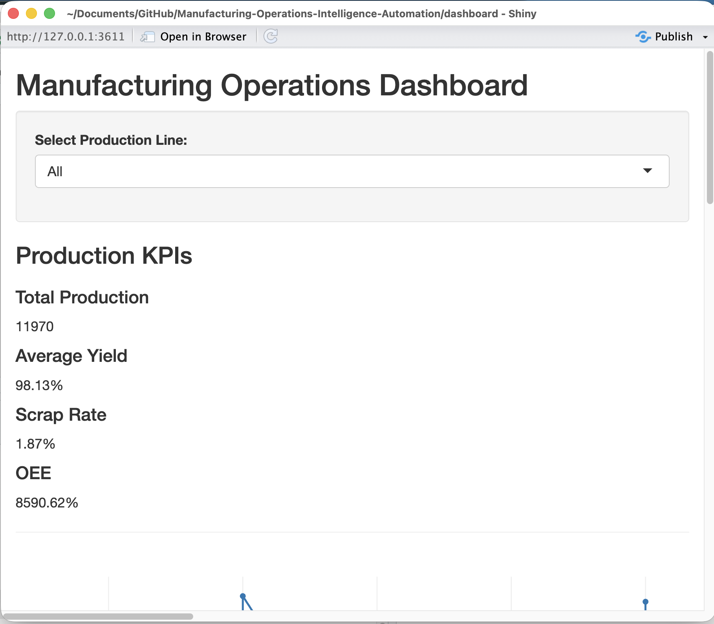
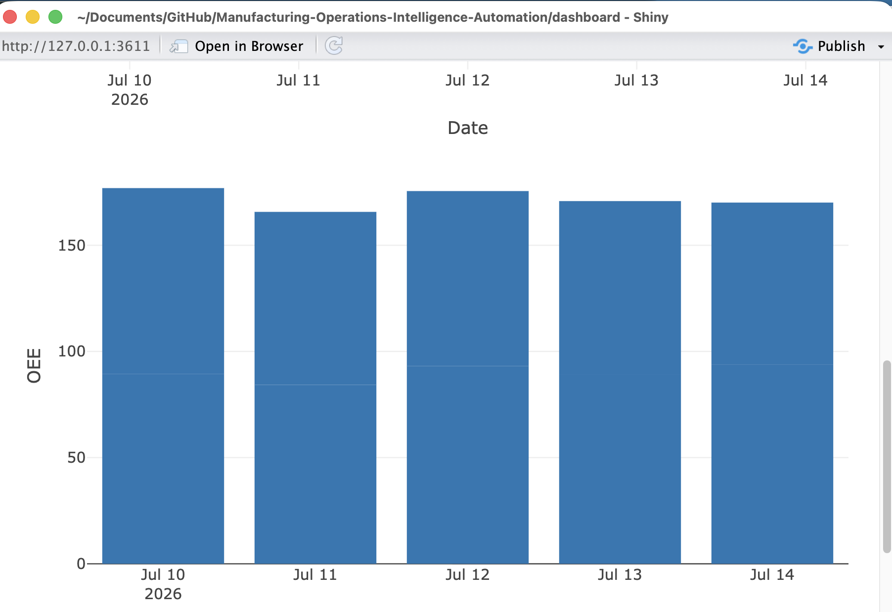
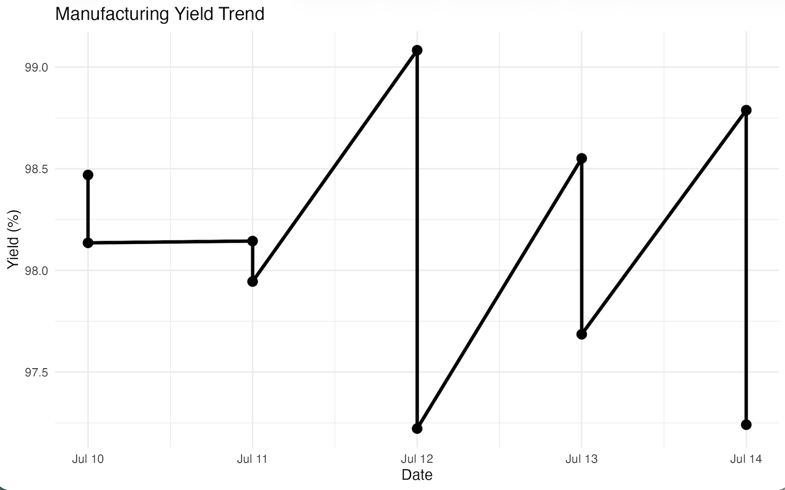
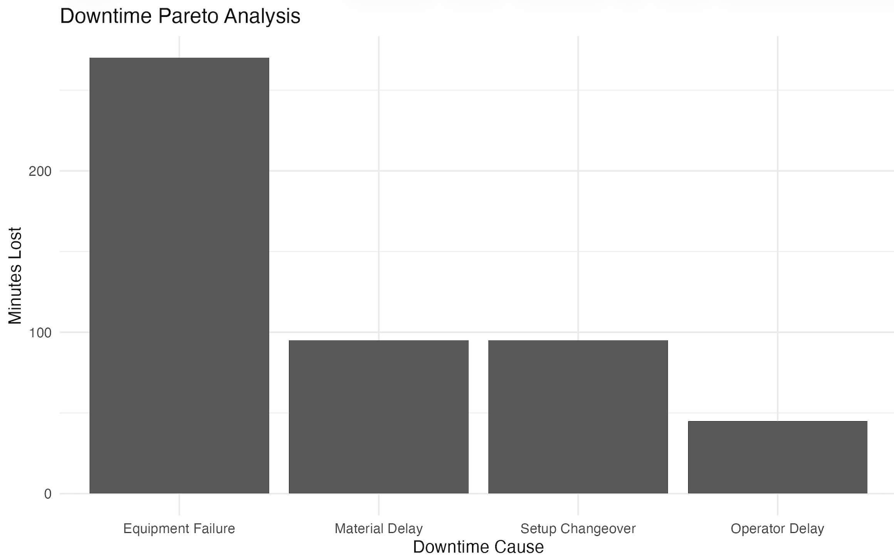

# Manufacturing Operations Intelligence Automation

## Version 2.0.0

An automated manufacturing analytics platform that transforms production data into actionable operational insights through ETL processing, KPI calculations, dashboards, automated reporting, and email delivery.

This project evolved from the original **Daily Report Mailer (v1.0.0)** sales reporting automation system into a manufacturing-focused intelligence platform designed to simulate real-world production performance monitoring.

---

# Project Overview

Manufacturing organizations rely on accurate production data to monitor efficiency, identify losses, and drive continuous improvement.

The **Manufacturing Operations Intelligence Automation** platform automates the process of:

1. Loading production data
2. Cleaning and preparing manufacturing records
3. Calculating key operational metrics
4. Generating manufacturing performance charts
5. Exporting dashboard-ready data
6. Creating automated reports
7. Delivering reports through email automation

The result is an end-to-end analytics workflow similar to systems used in manufacturing operations environments.

---

# Key Features

## Manufacturing KPI Engine

The pipeline calculates critical manufacturing performance indicators including:

* Production output
* Reject quantities
* Yield percentage
* Scrap percentage
* Downtime analysis
* Availability
* Performance
* Quality
* Overall Equipment Effectiveness (OEE)

---

## Automated Data Pipeline

The workflow follows a structured ETL architecture:

```
Production Data (CSV)
          |
          v
Data Loading
          |
          v
Data Cleaning
          |
          v
Manufacturing KPI Calculations
          |
          v
Chart Generation
          |
          v
Dashboard Data Export
          |
          v
Automated Report Generation
          |
          v
Email Distribution
```

---

# Technology Stack

## Analytics & Automation

* R
* R Markdown
* Tidyverse
* Lubridate
* Automated scripting

## Dashboard & Visualization

* Shiny Dashboard
* Manufacturing KPI visualizations
* Performance monitoring charts

---

## 📸 Screenshots & Demos

### Dashboard



Click below to watch the dashboard walkthrough:

[▶ Manufacturing Dashboard Demo](https://github.com/jd-dev-king/Manufacturing-Operations-Intelligence-Automation/raw/main/assets/Dashboard_Demo.mp4)


### HTML File

Click below to watch the HTML exploration:

[▶ Manufacturing HTML Demo](https://github.com/jd-dev-king/Manufacturing-Operations-Intelligence-Automation/raw/main/assets/HTML_Demo.mp4)

### Charts







### Github Actions Success


---

## DevOps / CI-CD

* GitHub
* GitHub Actions
* Automated pipeline execution

---

# Manufacturing Metrics

## Yield Performance

Measures the percentage of acceptable production output:

```
Yield % =
(Produced Units - Rejected Units)
/
Produced Units
× 100
```

---

## Scrap Monitoring

Tracks production losses caused by rejected units:

```
Scrap % =
Rejected Units
/
Produced Units
× 100
```

---

## Overall Equipment Effectiveness (OEE)

Evaluates manufacturing efficiency using:

```
OEE =
Availability × Performance × Quality
```

OEE provides insight into equipment utilization and production effectiveness.

---

# Project Structure

```
Manufacturing-Operations-Intelligence-Automation

├── data
│   └── production.csv

├── scripts
│   ├── 00_logger.R
│   ├── 01_load_data.R
│   ├── 02_clean_data.R
│   ├── 03_calculate_manufacturing_kpis.R
│   ├── 04_create_manufacturing_charts.R
│   ├── 05_export_dashboard_data.R
│   ├── 06_generate_recommendations.R
│   ├── 07_generate_report.R
│   └── 08_send_email.R

├── dashboard
│   └── app.R

├── charts
│   └── manufacturing_visualizations

├── reports
│   └── generated_reports

├── images
│   └── project_visuals

├── main.R

└── .github
    └── workflows
        └── r_pipeline.yml
```

---

# Automation Workflow

The GitHub Actions workflow automatically:

* Executes the R pipeline
* Generates updated analytics outputs
* Validates the reporting workflow
* Maintains repeatable automation

This enables consistent production reporting without manual intervention.

---

# Engineering Applications

This project demonstrates concepts applicable to:

* Manufacturing Engineering
* Process Engineering
* Operations Analytics
* Lean Six Sigma Continuous Improvement
* Production Performance Monitoring
* Data-Driven Decision Making

Potential real-world applications include:

* Batch manufacturing monitoring
* Production line performance tracking
* Scrap reduction initiatives
* Downtime reduction projects
* Operational excellence programs

---

# Version History

## v2.0.0 — Manufacturing Operations Intelligence Automation

Released: July 2026

Major upgrade from sales reporting automation to manufacturing intelligence analytics.

New capabilities:

* Manufacturing KPI engine
* Production analytics pipeline
* OEE calculations
* Automated dashboards
* Manufacturing reporting workflow
* GitHub Actions automation

---

## v1.0.0 — Daily Report Mailer

Original release focused on automated sales reporting, data processing, visualization, and email distribution.

---

# Future Enhancements

Planned improvements:

* Database integration (SQL)
* Real-time production monitoring
* API data ingestion
* Predictive maintenance analytics
* SPC control charts
* Automated anomaly detection
* Cloud deployment

---

# Author

Jeremiah Lupton

Manufacturing Analytics | Process Engineering | Data Automation
