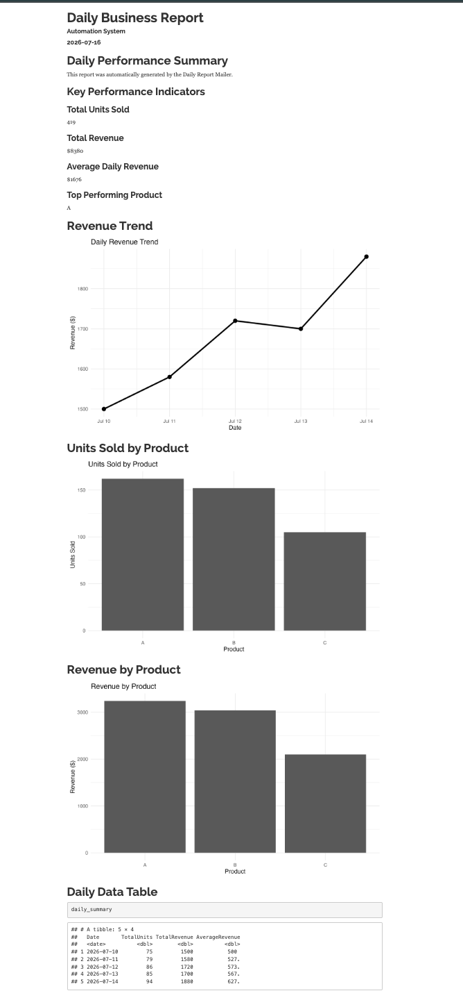
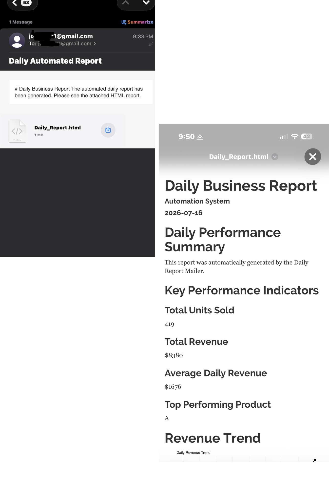

# Daily Report Mailer Automation

## Overview

The Daily Report Mailer is an automated reporting pipeline built in R that eliminates manual daily reporting tasks.

The system automatically:

- Loads operational data
- Cleans and validates data
- Calculates business KPIs
- Creates visual reports
- Generates an HTML summary
- Emails the completed report automatically

## Business Problem

Many organizations spend valuable time manually collecting data, creating charts, and distributing daily reports.

This project reduces repetitive work by creating a fully automated reporting workflow.

## Solution Architecture
CSV Data
|
↓
Data Loading
|
↓
Data Cleaning
|
↓
KPI Analysis
|
↓
Visualization
|
↓
HTML Report
|
↓
Email Delivery

## Technologies Used

- R Programming
- RStudio
- tidyverse
- dplyr
- ggplot2
- R Markdown
- blastula
- Git/GitHub

## Project Structure

Daily_Report_Mailer

├── data
│ └── sales.csv
│
├── scripts
│ ├── 00_logger.R
│ ├── 01_load_data.R
│ ├── 02_clean_data.R
│ ├── 03_calculate_kpis.R
│ ├── 04_create_charts.R
│ ├── 05_generate_report.R
│ └── 06_send_email.R
│
├── charts
├── reports
├── logs
│
├── main.R
└── Daily_Report.Rmd

## Features

- Automated data pipeline
- KPI reporting
- Automated visualization
- HTML report generation
- Email distribution
- Error logging

## Example Use Cases

This automation can be adapted for:

- Manufacturing production reports
- Quality metrics
- Inventory summaries
- Sales dashboards
- Operational KPIs

## Future Improvements

- Connect directly to SQL databases
- Add interactive dashboards using Shiny
- Deploy to cloud automation services
- Add database logging
- Add automated alerts

---

## 📸 Screenshots

### HTML Report Example

### Charts Example

### Email and Attachment Example

---

## Author

Jeremiah Lupton

